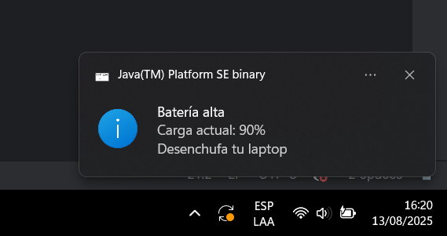

# BatteryMonitorApp

**Battery Monitor App** es una aplicación en Java que monitorea el estado de la batería en Windows, enviando notificaciones cuando es necesario conectar o desconectar el cargador.  
Se ejecuta automáticamente al iniciar el sistema y registra todas las lecturas y eventos en un archivo de log.

---
## 📌 Características

- 🔋 **Monitoreo automático** del nivel de batería cada 3 minutos.
- 📢 **Notificaciones emergentes** cuando:
    - La batería está **≥ 90%** y sigue cargando (recomienda desconectar).
    - La batería está **≤ 20%** y no está cargando (recomienda conectar).
- 📝 **Registro de eventos** en `BatteryApp.log` dentro de la carpeta del usuario.
- ⚙ **Ejecución automática al iniciar Windows** mediante configuración en el Registro.
- 🚀 Funciona en **segundo plano** sin interferir con el trabajo del usuario.

---
## 📸 Vista de la Notificación

Cuando el nivel de batería llega al 90%, se muestra una notificación como la siguiente:

---
## ⚙ Requisitos

- **Java** 17 o superior.
- Sistema operativo **Windows** (el monitoreo de batería usa comandos PowerShell).
- Permisos para modificar el **Registro de Windows** (para ejecución automática).

---

## 📥 Descargar
[Haz clic aquí para descargar BatteryMonitorApp.exe](./dist/BatteryMonitorApp.exe)